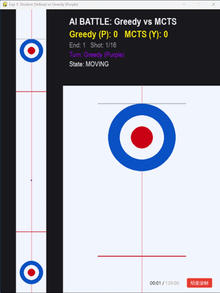

# Smart-Curling-AI
A Digital Curling AI based on MCTS and Genetic Algorithm.

# Smart Curling AI: 基于混合策略与 MCTS 的连续物理空间博弈模型

> 本项目构建了一个在连续物理空间下具备毫秒级响应能力的数字冰壶博弈 Agent。通过手写二维物理引擎，并结合蒙特卡洛树搜索 (MCTS)、遗传算法 (GA) 与深度学习价值网络，解决了冰壶运动中“连续动作空间发散”与“稀疏奖励”的算法痛点。

## Demo 演示

## 核心技术架构 (Core Architecture)

本项目并非调用现成的强化学习库，而是从零实现了底层物理仿真与决策大脑，核心模块如下：

### 1. 二维刚体物理引擎与环境仿真 (My Contribution)
- **离散化模拟：** 采用 `dt=0.015s` 时间切片，引入高斯噪声模拟真实冰面摩擦与冰壶的弧线运动（基于角速度计算侧向力），防止 AI 过拟合。
- **逆向物理动作生成：** 面对连续动作空间造成的“维度灾难”，将搜索问题转化为优化问题。通过**二分查找法**精确计算纵向力度，引入路径检测自动计算曲线绕击角度，实现 $O(1)$ 时间复杂度内的动作生成。

### 2. MCTS 与启发式剪枝
- **概率剪枝：** 摒弃盲目搜索，基于生成器返回高质量候选点，将无限分支降维至个位数。
- **智能防撞与定式：** 创新设计 `Offset` 偏移机制，中线拥堵时自动左右偏移 0.6m 形成“双翼护法”阵型，解决早期 AI 存在的自杀式占位痛点。

### 3. 遗传算法 (GA) 参数自适应 (My Contribution)
- 传统 MCTS 极度依赖人工设定的启发式估值。本项目引入遗传算法，对进营、击打、占位权重及力度修正系数进行**种群进化搜索**。
- 经历 10 代交叉变异与自对弈评估，最佳个体参数显著提升了 AI 在复杂碰撞环境下的适应力。

### 4. 神经网络价值评估加速
- **痛点：** 传统物理模拟（牛顿力学迭代）评估单步开销需 ~1500 Ops，耗时巨大。
- **优化：** 引入深度学习价值网络实现端到端映射（纯矩阵运算），将 200 次思考的耗时从 1.36s 压缩至 0.24s，**推理速度提升 5.6 倍**，满足实时博弈需求。

## 实验评估 (Evaluation)

在符合国际冰壶规则（含五壶保护）的标准化测试中：
- **测试基准：** 单场 8 局，共计 20 场高强度对弈。
- **对战表现：** 针对局部最优的贪心算法 (Greedy Agent)，本模型 (Student MCTS) 取得 **18 胜 2 负 (胜率 90%)** 的压倒性战绩。

## 不足与未来展望 (Limitations & Future Work)

尽管当前 Agent 在对抗基础算法时表现优异，但受限于冰壶极度复杂的连续物理状态，仍存在一定局限性：
1. **长线大局观不足：** 受限于单步 0.24s 的实时响应算力瓶颈，MCTS 的搜索深度有限。AI 目前更容易关注当前局的局部得分，偶尔会做出缺乏长远战略布局的次优决策。
2. **策略同质化：** 价值网络的拟合目前依赖于自对弈数据流，在面对人类高手的非标常规战术时，鲁棒性仍有待提升。
3. **Future Work：** 未来计划剥离手写启发式规则，全面引入深度强化学习框架（如 **PPO 或 SAC 算法**），让 AI 在连续动作空间中进行更深度的自我博弈与策略涌现。

